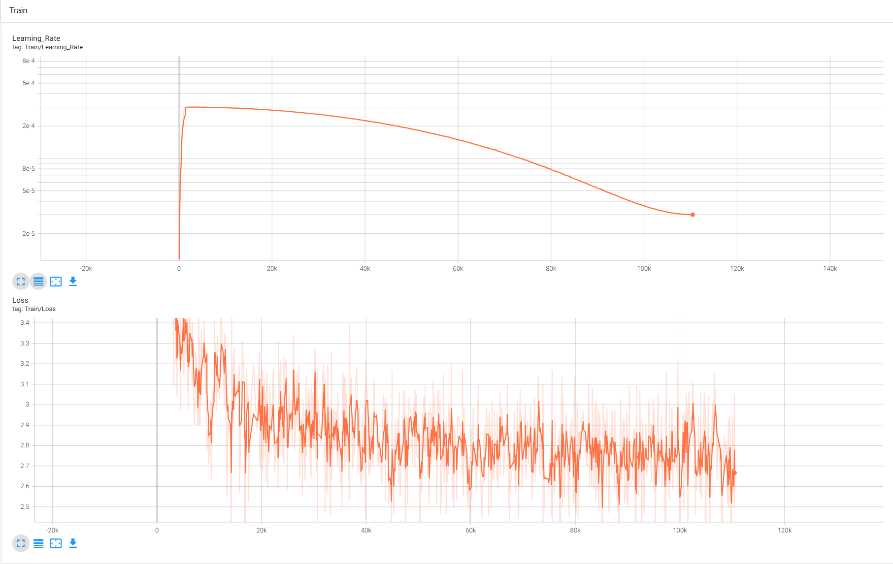
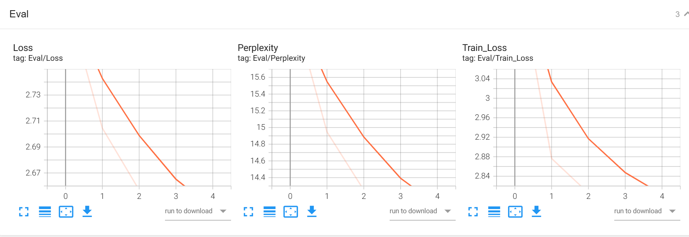

# GleamLM —— 面向教育和研究的小型语言模型


 **项目持续开发中， 点个 Star ⭐ 收藏，更新不错过。**

**现版本正在开发87M模型的代码，如果想测试项目，请用TAG：v0.1.0的软件包**

## 项目简介

纯 PyTorch 从零实现，零 HuggingFace 依赖，覆盖 **多源中文数据管线**（下载→清洗→去重→字符加权配比）→ **BBPE 分词器训练**（自研，零外部依赖）→ **Decoder-only 模型**（SwiGLU / GQA / RoPE / QK-Norm）→ **AMP + DDP 训练**（断点续训保存 optimizer/scheduler/scaler 全量状态）→ **SFT / DPO 对齐**（ChatML + loss mask）→FP16量化 → **KV Cache 流式推理**全链路。

| 版本 | 参数量 | 定位 | 状态 |
|------|--------|------|------|
| **GleamLM-Nano** | ~40M | 教学入门，单卡 12GB 即可完整训练 | ✅ 已完成 |
| **GleamLM-Lite** | ~87M | 消融实验平台，FFN 3.4× 扩容，Windows/Linux 双平台 | 🔨 训练中 |

## 技术架构

| 组件 | 方案 | 对标 |
|------|------|------|
| 范式 | Decoder-only | LLaMA 3 / Qwen3 |
| 归一化 | Pre-Norm + RMSNorm | LLaMA 3 / Qwen3 |
| 位置编码 | RoPE（支持长度外推） | LLaMA 3 / Qwen3 |
| 注意力 | GQA（8 Q-heads / 4 KV-heads）+ QK-Norm | LLaMA 3 |
| 激活函数 | SwiGLU | LLaMA 3 / Qwen3 |
| Tokenizer | BBPE 12K（自研，纯 Python） | — |
| 训练精度 | BF16/FP16 AMP | — |
| 分布式 | DDP（`torchrun` 一行启动） | — |
| 推理加速 | KV Cache + 流式生成 + 多采样策略 | — |

### 模型规格

| 参数 | Nano ~40M | Lite ~87M |
|------|:---:|:---:|
| 上下文窗口 | 1024 | **2048** |
| 词表大小 | 12,002（自研 BBPE） | 12,002（复用） |
| 网络层数 | 12 | 12 |
| 模型维度 | 512 | **768** |
| QK-Norm | ✅ | ✅ |
| 查询头 / KV 头 | 8 / 4 | **12 / 6** |
| SwiGLU 中间维度 | 1365 | **2048**（3.4× FFN 容量） |
| Dropout | 0.1 | 0.0 |
| Flash Attention | — | ✅ |
| Z-Loss | — | 1e-4 |
| 参数量 | **~40M** | **~87M** |
| Embed 占比 | 15% | 11% |
| FFN 参数 | 16.8M (41%) | **56.6M (65%)** |

> Lite 设计原则：测试证实 12 层是中文生成的硬阈值，且事实知识 100% 存于 FFN。因此保持 12 层不动，d_model 扩至 768，d_ff 按 SwiGLU 标准公式扩至 2048（3.4× FFN 容量），词表复用 Nano 的 12K。

---

## 项目结构

```
GleamLM/
├── gleamlm/                     # 共享核心库
│   ├── models/model.py          # GleamLMModel（RMSNorm/RoPE/GQA/SwiGLU/QK-Norm）
│   ├── tokenizer/tokenizer.py   # BBPE 12K 分词器（纯 Python 零依赖）
│   ├── dataset/dataset.py       # LMDataset（memmap 滑动窗口 + 预分词缓存）
│   ├── inference/               # KV Cache 流式生成 + 多采样策略
│   └── utils/                   # 配置加载 / LR 调度 / Z-Loss / autocast
│
├── gleamlm-nano/                # 40M 教学版
│   ├── train.py                 # 预训练（AMP + DDP + Cosine + 断点续训）
│   ├── infer.py                 # 推理（KV Cache + 交互式对话 + SFT 模式）
│   ├── sft.py                   # SFT 指令微调（ChatML + loss mask）
│   ├── dpo.py                   # DPO 偏好对齐（policy + frozen reference）
│   ├── quantize.py              # FP16 量化导出
│   ├── quick_test_sft_dpo.py    # SFT+DPO 全链路快速验证
│   ├── evaluation/              # PPL 评估 + 生成样例
│   └── checkpoints/             # 模型权重 + TensorBoard 日志
│
├── gleamlm-lite/                # 87M 实验版
│   ├── train.py                 # 预训练（Cosine LR + FlashAttn + Z-Loss）
│   ├── infer.py                 # 推理（2048 context + KV Cache）
│   ├── sft.py                   # SFT 指令微调
│   ├── dpo.py                   # DPO 偏好对齐
│   ├── test_train.py            # 轻量训练冒烟测试
│   └── evaluation/              # PPL 评估 + 生成样例
│
├── configs/                     # YAML 配置继承
│   ├── base.yaml                # 全局默认值
│   ├── nano.yaml                # 40M 配置
│   └── lite.yaml                # 87M 配置
│
├── data_tools/                  # 数据处理管线
│   ├── download_data.py         # 多源数据下载
│   ├── prepare_data.py          # 一键管线（清洗→去重→混合→切分）
│   ├── build_dataset.py         # 流式多源混合 + train/valid/test 切分
│   ├── clean_text.py            # 文本清洗（长度/语言/广告过滤）
│   ├── dedup_text.py            # 去重（MD5 exact / prefix）
│   ├── filter_qa.py             # QA 专项过滤
│   ├── extract_parquet.py       # Parquet → txt 转换
│   ├── generate_sft_data.py     # DeepSeek API 蒸馏 SFT 数据
│   └── clean_sft_data.py        # SFT 数据格式清洗
│
├── scripts/                     # 评估 + 验证脚本
│   ├── eval_ppl.py              # PPL 评估
│   ├── eval_knowledge.py        # 知识评估
│   ├── eval_layer_dropout.py    # 层 dropout 测试
│   ├── verify_both.py           # 40M+87M 双模型验证
│   └── verify_lite.py           # 87M 单独验证
│
├── tests/                       # 核心库测试
│   ├── test_model.py            # 模型前向/反向/KV Cache 测试
│   ├── test_tokenizer.py        # Tokenizer 冒烟测试
│   ├── test_dataset.py          # 数据集和 collate_fn 测试
│   └── test_evaluation.py       # 评估模块测试
│
├── data/
│   ├── nano_data/               # Nano 训练/验证/测试 + .npy 缓存
│   ├── lite_data/               # Lite 训练/验证/测试 + .npy 缓存
│   ├── sft_data.jsonl           # SFT 训练数据（10000 条）
│   └── dpo_data.jsonl           # DPO 训练对
│
├── docs/                        # 开发文档
├── requirements.txt             # Python 依赖
└── README.md
```

---

## 快速开始

### 环境

- Python 3.10+
- PyTorch 2.5+ with CUDA 12.4
- RTX 4070 Ti 12GB（或同等显存）

```bash
pip install -r requirements.txt
```

### 1. 数据准备（一键管线）

```bash
# 下载原始数据（仅首次）
pip install py7zr kagglehub
python data_tools/download_data.py

# 一键：清洗 → 去重 → QA过滤 → 字符加权配比 → 混合切分
python data_tools/prepare_data.py --input data/raw --output data/nano_data

# 自定义配比（字符占比）
python data_tools/prepare_data.py --ratios 0.30 0.12 0.43 0.15
```

### 2. 预训练

#### GleamLM-Nano（40M）

```bash
python gleamlm-nano/train.py --config configs/nano.yaml

# 断点续训
python gleamlm-nano/train.py --config configs/nano.yaml --load_checkpoint gleamlm-nano/checkpoints/checkpoint_epoch_3.pt

# 监控
tensorboard --logdir ./gleamlm-nano/checkpoints/runs
```

| 关键参数 | 默认值 | 说明 |
|----------|--------|------|
| `--epochs` | 5 | 训练轮数 |
| `--batch_size` | 4 | Micro-batch（显存安全） |
| `--accumulate_grad` | 16 | 梯度累积（有效 batch=64） |
| `--lr` | 3e-4 | 峰值学习率 |
| `--label_smoothing` | 0.1 | 标签平滑 |

单卡 RTX 4070 Ti 12GB，每 epoch ~15 小时，5 epoch 约 75 小时。预训练基座模型已在魔搭上线：[GleamLM-Nano · 模型库](https://www.modelscope.cn/models/philexohf/GleamLM-Nano)。

#### GleamLM-Lite（87M）

```bash
python gleamlm-lite/train.py --config configs/lite.yaml

# 断点续训
python gleamlm-lite/train.py --config configs/lite.yaml --load_checkpoint gleamlm-lite/checkpoints/checkpoint_epoch_1.pt
```

| 关键参数 | 默认值 | 说明 |
|----------|--------|------|
| `--epochs` | 2 | 训练轮数（起步观察） |
| `--batch_size` | 4 | Micro-batch（显存安全） |
| `--accumulate_grad` | 16 | 梯度累积（有效 batch=64） |
| `--lr` | 4e-4 | 峰值学习率（更大模型梯度方差小） |
| `--z_loss_weight` | 1e-4 | Z-Loss 防 logit 爆炸 |

87M 的 2× 宽度 + 2× seq_len，计算量约 Nano 的 4×。单卡 12GB 可训（~8-9 GB），建议多卡 DDP 加速。

优化器：AdamW（β=0.9,0.95，wd=0.01），BF16 AMP，Cosine Warmup + Decay，Flash Attention（`F.scaled_dot_product_attention`）。首次运行自动 BBPE 分词，后续 mmap 加载 ~1MB。

### 3. 推理

```bash
# --- Nano 40M ---

# 单次生成
python gleamlm-nano/infer.py --model gleamlm-nano/checkpoints/best_model.pt --prompt "人工智能是"

# 交互模式
python gleamlm-nano/infer.py --model gleamlm-nano/checkpoints/best_model.pt

# SFT 模型推理（ChatML 格式 + <|im_end|> 自动截断）
python gleamlm-nano/infer.py --model gleamlm-nano/checkpoints/sft/sft_best.pt --sft --prompt "你好，请介绍一下你自己。"

# DPO 模型推理
python gleamlm-nano/infer.py --model gleamlm-nano/checkpoints/dpo/dpo_best.pt --sft --prompt "什么是机器学习？"

# --- Lite 87M ---

python gleamlm-lite/infer.py --model gleamlm-lite/checkpoints/best_model.pt --prompt "人工智能是"
python gleamlm-lite/infer.py --model gleamlm-lite/checkpoints/best_model.pt  # 交互模式
```

### 4. SFT 指令微调

```bash
# Nano
python gleamlm-nano/sft.py --data_path ./data/sft_data.jsonl --model_path ./gleamlm-nano/checkpoints/best_model.pt

# Lite
python gleamlm-lite/sft.py --data_path ./data/sft_data.jsonl --model_path ./gleamlm-lite/checkpoints/best_model.pt
```

### 5. DPO 偏好对齐

```bash
# Nano
python gleamlm-nano/dpo.py --data_path ./data/dpo_data.jsonl --model_path ./gleamlm-nano/checkpoints/sft/sft_best.pt

# Lite
python gleamlm-lite/dpo.py --data_path ./data/dpo_data.jsonl --model_path ./gleamlm-lite/checkpoints/sft/sft_best.pt
```

### 6. 量化导出

FP32 → FP16，体积减半，推理精度基本无损。

```bash
# Nano
python gleamlm-nano/quantize.py --input gleamlm-nano/checkpoints/best_model.pt --output gleamlm-nano/checkpoints/model_fp16.pt

# DPO 模型
python gleamlm-nano/quantize.py --input gleamlm-nano/checkpoints/dpo/dpo_best.pt --output gleamlm-nano/checkpoints/dpo/dpo_fp16.pt
```

### 7. 运行测试

```bash
pip install -e ".[dev]"
pytest tests/ gleamlm-nano/tests/ gleamlm-lite/tests/ -v
```

---

## 数据集

### 数据来源与清洗

| 数据源 | 原始 | 清洗后 | 保留率 |
|--------|:---:|:---:|:---:|
| 中文维基 | 565万 | 545万 | 96.4% |
| 百度百科 | 214万 | 213万 | 99.8% |
| 新闻 2016 | 202万 | 171万 | 84.5% |
| 社区问答 | 403万 | 92万 | 22.8% |
| **合计** | **1,384万** | **1,021万** | **73.8%** |

### GleamLM-Nano 字符加权配比

各源行均字符差异巨大（新闻 ~752 字/行 vs 维基 ~123 字/行），`prepare_data.py` 自动按字符占比换算行数配比：

| 源 | 目标字符比 | 行均字符 | → 行数配比 |
|---|---|---|---|
| wiki | 30% | 123 | 52.8% |
| baike | 12% | 145 | 17.9% |
| news | 43% | 752 | 12.4% |
| qa | 15% | 192 | 16.9% |

> Nano 最终数据：train 6.48 GB / valid 0.36 GB / test 0.36 GB，~1.2B 训练字符。

### GleamLM-Lite 五源配比

Lite 在四源基础上引入 [Chinese FineWeb Edu](https://huggingface.co/datasets/opencsg/chinese-fineweb-edu)（教育级质量过滤网页文本），数据量从 ~1.2B 提升至 ~4.3B tokens：

| 数据源 | token 估算 | 字符配比 | 文件大小 |
|--------|-----------|:---:|------|
| Chinese FineWeb Edu | ~1.5B | 35% | 5.8 GB |
| 中文新闻 | ~870M | 20% | — |
| 中文维基 | ~870M | 20% | — |
| 百度百科 | ~650M | 15% | — |
| 社区问答 | ~435M | 10% | — |
| **总计** | **~4.3B** | **100%** | **13.85 GB** |

> Chinchilla 最优 ~1.74B tokens（87M × 20），当前 2.5× 超出，保留多 epoch 训练余地。

---

## GleamLM-Lite 训练结果

> 87M Lite 当前训练中，结果将在训练完成后更新。目标 PPL **< 10**（Nano 基线 13.65，FFN 3.4× 扩容 + FlashAttn + Z-Loss 叠加预期）。

| 参数 | Nano 40M | Lite 87M |
|------|------|------|
| 优化器 | AdamW | AdamW |
| 学习率 | 3e-4 | 4e-4 |
| LR 调度 | Cosine | Cosine（WSD 为后续消融选项） |
| Attention | 手写 | `F.scaled_dot_product_attention` |
| Z-Loss | 无 | 1e-4 |
| Dropout | 0.1 | 0.0 |
| 数据量 | ~1.2B chars | ~4.3B tokens |

---

## GleamLM-Nano 训练结果

### （BBPE 12K + 字符加权四源混合，~40M）






训练配置：`batch_size=4, accumulate_grad=16`（等效 64），`label_smoothing=0.1`，`stride=768`，Cosine Warmup + Decay，12GB 显存持续 ~92% 满载。

| Epoch | Train Loss | Val Loss | PPL | PPL↓ | 备注 |
|-------|-----------|----------|-----|------|------|
| 0 | 3.2960 | 2.8064 | 16.55 | — | 语法收敛，生成通顺但内容空洞 |
| 1 | 2.8764 | 2.7045 | 14.95 | -1.60 | 首句沾边，后续漂移 |
| 2 | 2.8053 | 2.6568 | 14.25 | -0.70 | 高频事实固化中 |
| 3 | 2.7655 | 2.6255 | 13.81 | -0.44 | 边际收益递减，改善持续 |
| 4 | 2.7440 | 2.6136 | **13.65** | -0.16 | 训练完成，全程无过拟合 |


**最佳结果**：`val_loss=2.6136`，`val_ppl=13.65`，模型保存至 `./checkpoints`。

> 输出通顺、格式清晰、首句基本沾边。5 个 epoch 全程无过拟合，val_loss 和 ppl 持续下降，边际收益递减但仍未完全收敛。长尾事实知识受限于 40M 参数容量，后续将通过 SFT + DPO 对齐改善。

**Epoch 4 最佳模型生成样例**（temperature=0.5, repetition_penalty=1.1, max_new_tokens=35）：

| 输入 | 输出（节选） |
|------|------|
| `中国有五千年的` | 历史，是中华人民共和国的一部分。（首词正确预测"历史"）... |
| `机器学习是人工智能的` | 一个重要方面。（精准命中常见搭配）... |
| `读书的好处是` | 每个人都会有自己的兴趣爱好和想法，不管你是否喜欢阅读，都可以通过阅读... |
| `世界上最高的山峰是` | 位于中国西藏自治区拉萨市南部的一座山峰，海拔高度1,463米。（地理关联正确）... |

> 模型对高频搭配和常见知识有一定记忆（如"五千年→历史"、"AI→一个方面"），能保持续写方向大致相关。但在长尾知识上仍会发散到无关话题。这是 40M 小模型在纯预训练阶段的物理上限，后续通过 SFT + DPO 对齐可显著改善。

### GleamLM-Nano SFT + DPO（40M 对齐验证）

#### SFT 数据生成

采用 DeepSeek-V4-Pro API 蒸馏生成 10000 条高质量中文指令数据（`data/sft_data.jsonl`），三类配比：

> **API 配置**：如需重新生成数据，需设置环境变量 `DEEPSEEK_API_KEY`（DeepSeek 控制台创建 API Key）。当前仓库已包含生成好的 `data/sft_data.jsonl`，无需额外配置即可直接训练。

| 类别 | 占比 | 条数 | 内容范围 |
|------|:---:|------|----------|
| **A 类 · 通用问答** | 40% | 4000 | 烹饪技巧、家务整理、健康习惯、学习方法、安全科技、旅行出行、生活妙招 |
| **B 类 · 知识回答** | 30% | 3000 | 历史（25 条基础）、地理（19 条）、科学（25 条）、文化（18 条），通过模板扩展至 3000 条 |
| **C 类 · 创作与闲聊** | 30% | 3000 | 描写创作（夕阳、大海、星空等）、情感感悟（孤独、成长、友情等）、日常聊天、观点讨论 |

数据格式为**标准 ChatML**（V4 BBPE 12K 词表原生支持 `<|im_start|>` / `<|im_end|>` 特殊 token）：

```
<|im_start|>system
你是一个乐于助人的AI助手。<|im_end|>
<|im_start|>user
如何煮出一碗好吃的面条？<|im_end|>
<|im_start|>assistant
煮好面条的诀窍：水要多，水开后下面，用筷子拨散防止粘连...<|im_end|>
```

训练时仅对 `assistant` 部分计算 loss（loss mask），确保模型学会回答而非重复问题。

#### SFT 指令微调

```bash
# 从头训练
python gleamlm-nano/sft.py --data_path ./data/sft_data.jsonl --model_path ./gleamlm-nano/checkpoints/best_model.pt

# 断点续训
python gleamlm-nano/sft.py --data_path ./data/sft_data.jsonl --model_path ./gleamlm-nano/checkpoints/best_model.pt --resume ./gleamlm-nano/checkpoints/sft/sft_epoch_1.pt
```

| 参数 | 值 | 说明 |
|------|-----|------|
| 训练数据 | 10000 条 | JSONL 格式，ChatML 包装 |
| 训练轮数 | 3 epochs | 避免过拟合 |
| 学习率 | 5e-6 | 预训练的 1/60，保护通用能力 |
| Batch size | 8 | accumulate=4，有效 batch=32 |
| 格式 | ChatML + loss mask | 仅 assistant 部分计算损失 |
| 预计耗时 | ~55 分钟 | 单卡 12GB |
| 续训 | `--resume PATH` | 从 checkpoint 恢复 optimizer/scheduler/scaler 状态续训 |

- **ChatML + loss mask**：V4 BBPE 已原生支持 `<|im_start|>`（token_id=12000）、`<|im_end|>`（token_id=12001），无需格式绕过
- **评估方式**：对比微调前后对同一 prompt 的生成质量，检验是否从"续写"转为"直接回答"

**SFT 训练结果**（lr=5e-6, epochs=3）：

| Epoch | train_loss | 说明 |
|-------|-----------|------|
| 0 | 3.3279 | 初始状态，loss 与预训练末期接近 |
| 1 | ~2.8 | 开始适应 ChatML 格式 |
| 2 | ~2.2 | 对话格式基本学会 |

> 提升 10 倍学习率后，模型仅需 3 个 epoch 即可掌握对话格式。loss 从 3.3 降至 2.2，说明模型有效学习了指令跟随能力。

**SFT 后生成样例**（`--sft --temperature 0.7 --repetition_penalty 1.15 --max_new_tokens 128`）：

| Prompt | 模型输出 | 评价 |
|--------|----------|------|
| 你好，请介绍一下你自己 | 如果你是个人，建议你先学会分析别人的优劣... | 格式正确（直接回答），但内容偏移到人生建议 |
| 什么是机器学习 | 机器学习是指将信息传递给机器人，从而实现机器学习的一种方法... | 方向沾边，夹杂大量无关细节 |
| 请用一句话描述北京的秋天 | 北京是世界上最大的热带气旋生物多样性保护区... | 完全幻觉，缺乏事实锚点 |
| 写一首关于春天的五言诗 | 春天是温暖的季节，是安静的季节... | 没写成诗，只是在描述春天 |
| 请解释一下什么是光合作用 | 光合作用是一种天然的氧化物，分子量约2000万个太阳质量... | 方向沾边，但事实严重错误 |

> **结论**：SFT 成功让模型从"续写"转为"直接回答"，格式层面完全达标。但 40M 参数容量不足以支撑事实性知识的精准记忆——这是小模型的物理上限，而非训练问题。后续通过 DPO 对齐可进一步提升安全性和回答质量。

#### DPO 偏好对齐

```bash
python gleamlm-nano/dpo.py --data_path ./data/dpo_data.jsonl --model_path ./gleamlm-nano/checkpoints/sft/sft_best.pt
```

| 参数 | 值 | 说明 |
|------|-----|------|
| 训练数据 | 150 对 chosen/rejected | SFT 模型生成 rejected（回答同一问题但答错），DeepSeek 输出作为 chosen |
| 训练轮数 | 1 epoch | β=0.1，学习率 1e-7 |
| DPO loss | 0.89 → 0.79 | 偏好信号有效学习，loss 下降 11% |
| 预计耗时 | ~2 分钟 | 150 对数据，batch=2×2 |

**DPO 后生成样例**（`--sft --temperature 0.7 --repetition_penalty 1.15 --max_new_tokens 128`）：

| Prompt | SFT 后 | DPO 后 | 改善 |
|--------|--------|--------|:---:|
| 北京秋天 | 北京是世界上最大的热带气旋生物多样性保护区 | 落叶遍野、金黄如雪、红得让人心旷神怡 | 🟢 |
| 光合作用 | 天然的氧化物，分子量约2000万个太阳质量 | 生物体生长发育和光照时间变化 | 🟢 |
| 自我介绍 | 如果你是个人，建议先学会分析别人的优劣 | 练字孩子的成长故事 | ⬜ 叙事更连贯但仍跑题 |
| 机器学习 | 将信息传递给机器人 | 操作系统/计算机模块分离 | ⬜ 方向修正，细节仍幻觉 |
| 五言诗 | 春天是温暖的季节，是安静的季节 | 描写+引经据典（三国/水浒） | ⬜ 更有文采，但未成诗 |

> **DPO 结论**：最显著的效果是纠正方向性错误（不再说北京是保护区、光合作用有太阳质量）。但 40M 参数注定无法记住精准事实。GleamLM-Nano 全链路（预训练→SFT→DPO）至此收尾，下一阶段转向 GleamLM-Lite（80M）预训练。

---

## 版本路线

| 版本 | 参数量 | 定位 | 状态 |
|------|--------|------|------|
| GleamLM-Nano | ~40M | 教学入门 / 单卡 12GB | ✅ 已完成 |
| GleamLM-Lite | ~87M | 消融实验平台 / FFN 3.4× | 🔨 训练中 |
| GleamLM-Pro | ~126M | 科研进阶 / 服务器资源 | 📋 规划中 |
| GleamLM-0.6B | ~0.6B | 工业级验证 / 算力集群 | 📋 寻求合作 |

---

## 安全提示

所有 checkpoint 加载使用 `torch.load(weights_only=False)`，这是加载优化器状态、Python 对象（如 argparse Namespace）等非张量数据的必要条件。**请勿加载来源不明的 checkpoint 文件**，否则存在 pickle 反序列化攻击风险。仅加载自己训练或可信来源的 checkpoint。

---

## 许可证

Apache License 2.0
