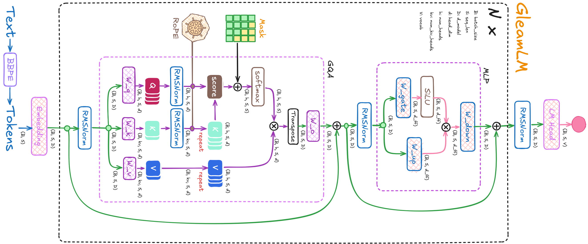
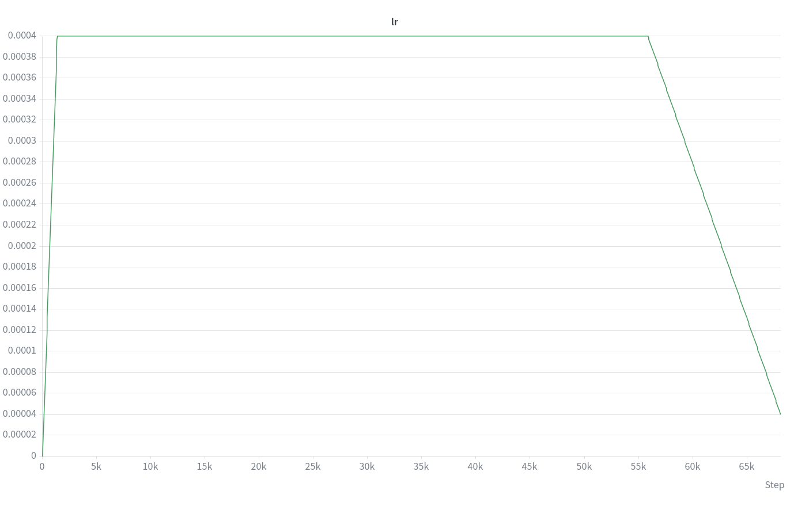
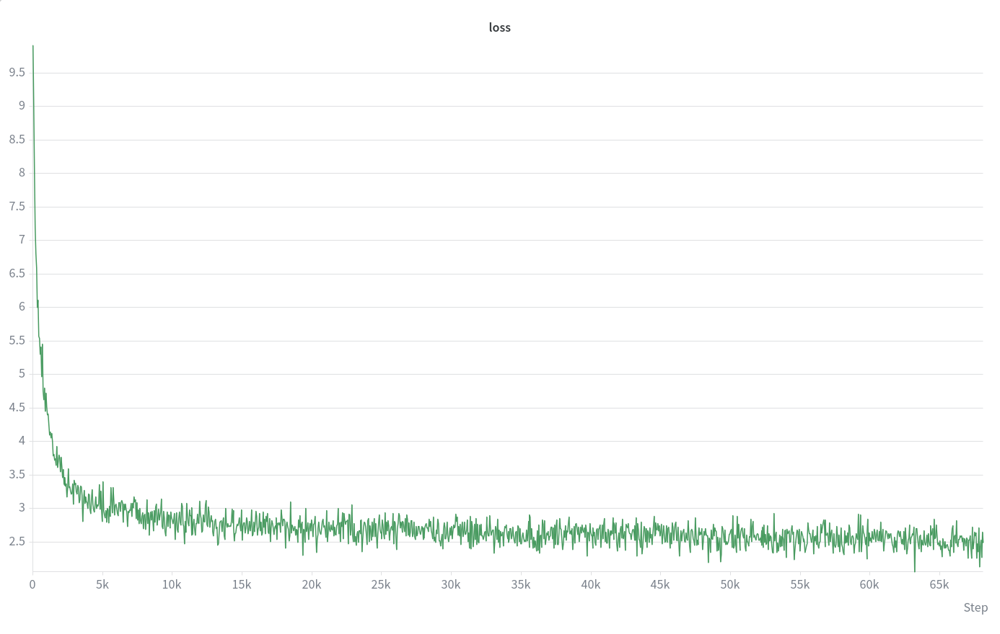

# GleamLM —— 面向教育和研究的小型语言模型

GleamLM 是一套从零实现的 LLM 工程实践项目，基于 PyTorch 原生手写，覆盖模型架构、BBPE 分词器、数据管道、预训练与后训练全流程。同时兼容 Hugging Face 生态，可对接 transformers、Megatron、TRL、PEFT 和 vLLM 等框架。

项目不追求刷榜 SOTA，专注 **可解释、可复现和可落地**，帮助开发者打通完整的 LLM 工程链路。

**能力覆盖**

- **数据管道**：多源数据自动下载、粗去重、文本清洗、SimHash/MinHash 精细去重和字符级配比均衡；

- **分词系统**：纯 Python 自研 BBPE 分词器，支持按 `manual/configs/*.yaml` 配比从零训练（词频聚合内存优化，200M 字符仅 ~1.2GB）、编码解码与 HF 格式导出；

- **模型架构**：Decoder-only，原生实现 SwiGLU FFN、GQA、RoPE、QK-Norm 和 Mamba 等结构；

- **预训练体系**：AMP 混合精度（BF16 免 scaler）、DDP 分布式训练、wd 分组（embedding+norm 去 wd）、WSD 调度（decay 可线性）、确定性采样 + `consumed_train_samples` 精确断点续训，以及稳定收敛调优方案；

- **后训练对齐**：SFT、DPO、PPO、GRPO 和 OPD 全流程，以及 LoRA 微调；

- **推理部署**：KV Cache 流式推理、模型量化、ONNX 导出、vLLM 高性能部署，以及 API 服务化；

- **模型评测**：基于 lm-evaluation-harness 官方框架评测 CEVAL、CMMLU、MMLU 等主流中文/英文能力；安装：`pip install -e ".[eval]"`。

---

## 项目定位

GleamLM 面向大语言模型预训练与后训练工程师，目标是理解原理和工业实战，不追求刷榜。

项目帮你解决三个问题：

**1. 模型内部长什么样**

搞懂 GQA 的 KV Head 怎么复用、QK-Norm 为什么是标配、RoPE 外推怎么做。训练出问题时（loss spike、梯度异常），能定位原因而不是只会调参。

**2. 工业框架怎么用**

掌握标准工具栈：TRL 做 DPO/GRPO、PEFT 做 LoRA、vLLM 做部署。团队协作时能直接上手。

**3. 完整链路走过没有**

从原始数据到能聊天的服务，完整走一遍：数据筛选、清洗去重、预训练、指令微调、强化对齐、模型量化、服务上线。每一步做了什么、为什么这样做，心里有数。

项目采用**双轨设计**：

**manual 手写实现**

核心算法、模型结构、训练逻辑全部从零实现。目的是理解技术细节，出问题知道怎么修。

**industrial 工业框架**

基于 TRL、DeepSpeed、PEFT 和 vLLM 等框架实现，对接工业界实际使用的工具链。目的是能用标准工具干活，适应团队协作流程。

两边对照，原理和工程能力都有。

---
## GleamLM 模型结构（MLP版）



## 技术架构

| 组件 | 实现方式 | 为什么这样选 |
|:---|:---|:---|
| **范式** | Decoder-only（对标 LLaMA 3 / Qwen3） | 当前主流 |
| **归一化** | Pre-Norm + RMSNorm | 训练稳定，Post-Norm 已淘汰 |
| **位置编码** | RoPE + YaRN 外推 | 当前主流 |
| **注意力** | GQA + QK-Norm + KV Cache | 2024-2025 标配 |
| **注意力变体** | NoPE / ALiBi / Sliding Window | 理解不同设计选择的代价 |
| **激活函数** | SwiGLU（FFN） | 替代 ReLU 的现代选择 |
| **MoE** | Router + Top-K + aux_loss | 稀疏激活，Mixtral 同款 |
| **状态空间** | Mamba-1 教学实现 | SSM vs Attention 基础知识 |
| **训练精度** | BF16/FP16 AMP（BF16 免 scaler，FP16 才启用） | 混合精度训练 |
| **分布式** | DDP + FSDP + DeepSpeed | 三种策略对比 |
| **分词器** | BBPE 12K（纯 Python 自研） | 理解词表构建全流程 |
| **推理加速** | KV Cache + 流式生成 + Flash Attention | 推理延迟优化 |
| **对齐** | SFT → 对齐（DPO / PPO / GRPO 并列可选）→ OPD（可选） | 完整后训练链条 |
| **LoRA（可选）** | 手写 + PEFT 双版本 | 理解低秩适应的数学原理 |
| **HF 集成** | `from_pretrained` / `GleamLMForCausalLM` | 自定义模型接入标准姿势 |
| **部署** | vLLM + ONNX + FastAPI | 模型上线全链路 |

### 模型规格

| 参数 | Nano ~40M | Lite ~87M | Pro ~126M | 0.6B |
|------|:---:|:---:|:---:|:---:|
| 层数 | 12 | 12 | 18 | 37 |
| 维度 | 512 | 768 | 768 | 1024 |
| 词表 | 12,002 | 12,002 | 12,002 | 24,002 |
| 查询头 / KV 头 | 8 / 4 | 12 / 6 | 12 / 6 | 16 / 8 |
| 数据量 | 4.47B tokens | 4.47B tokens | — | — |
| 显存需求 | 单卡 12GB | 单卡 12GB | 单卡 16GB+ | 多卡 |

> **Lite 设计原则**：测试证实 12 层是中文生成的阈值，且事实知识全部存于 FFN。因此保持 12 层不动，d_model 扩至 768，d_ff 按 SwiGLU 标准公式扩至 2048（3.4× FFN 容量），词表复用 Nano 的 12K。

---

## 项目结构

```
GleamLM/
├── gleamlm/                       # 核心库：完整学习路径（数据 → 模型 → 训练 → 推理）
│   ├── tokenizer/                 # ① BBPE 分词器（训练/编码/解码/HF 导出；checkpoints/bbpe_12k 为成品词表）
│   ├── data/                      # ② 数据层：管线编排 + 各阶段数据集
│   │   ├── pipeline.py            #   预训练 6 阶段管线（粗去重→清洗→质量→细去重→切分→打包）
│   │   ├── pack.py / dataset.py   #   文本 → Megatron .bin/.idx 打包 / mmap 懒加载数据类
│   │   ├── sft_data.py / dpo_data.py / rl_data.py  # 后训练数据集（SFT JSONL / DPO 偏好对 / RL prompt）
│   │   └── preprocess.py          #   文件流式预处理引擎（各变体共用）
│   ├── models/                    # ③ 模型架构
│   │   ├── model.py               #   GleamLMModel（GQA / RoPE / SwiGLU / MoE / QK-Norm）
│   │   ├── attention_variants.py  #   NoPE / ALiBi / Sliding Window GQA
│   │   └── mamba.py               #   Mamba-1 教学实现
│   ├── trainer/                   # ④ 训练支撑
│   │   ├── base_trainer.py        #   预训练原子原语（optimizer_step / GradScaler）
│   │   ├── rl_trainer.py          #   PPO / GRPO 训练支撑 + 共享奖励函数
│   │   ├── dpo_loss.py / distill_loss.py  # DPO / 蒸馏 loss（独立可测）
│   │   ├── schedulers.py          #   WSD / cosine 等 LR 调度
│   │   └── lora.py                #   LoRA 从零实现
│   ├── inference/                 # ⑤ 推理与生成
│   │   ├── generator.py           #   自回归生成核心（KV Cache + 采样循环）
│   │   ├── generate.py            #   共享生成工具（评估 / 数据生成复用）
│   │   ├── streamer.py / speculative.py  # 流式输出 / 推测解码
│   │   ├── conversation.py        #   多轮对话管理（KV cache 复用）
│   │   └── cli.py                 #   统一推理 CLI
│   ├── rag/                       # ⑥ RAG 检索增强（BM25 + Dense 双路）
│   ├── utils/                     # ⑦ 工具集（config / AMP / ChatML）
│   ├── evaluation/                # ⑧ 评测（PPL 基础指标；标准 benchmark 见 eval/）
│   └── api.py / types.py          #   推理便捷入口 / 共享类型
│
├── manual/                        # 手写训练脚本（教学轨，完整实现细节）
│   ├── pretrain.py                #   预训练（AMP / DDP / 断点续训）
│   ├── sft.py / sft_lora.py       #   SFT 全量微调 / LoRA 微调（手写实现）
│   ├── dpo.py / grpo.py / ppo.py  #   DPO / GRPO / PPO 后训练对齐
│   ├── opd.py                     #   OPD 在线策略蒸馏（学生采样 → 教师打分 → reverse KL）
│   ├── distill.py                 #   知识蒸馏
│   ├── deepspeed.py / fsdp.py     #   分布式训练
│   ├── infer.py                   #   交互式推理（命令行入口）
│   ├── train_tokenizer.py         #   BBPE 分词器训练（--variant 读配比 / --data_dir / 扩展 / 验证）
│   └── configs/                   #   手动轨专用 YAML（仅 manual 轨脚本消费）
│       ├── base.yaml              #   公共默认 / 新配置模板（复制改名即可新建）
│       ├── nano.yaml / lite.yaml / pro.yaml  #   各变体独立完整配置（不依赖继承）
│       └── deepspeed_config.json / deepspeed_zero2.json  #   DeepSpeed 引擎参数
│
├── industrial/                    # 工业训练脚本（对接 Megatron / TRL / PEFT / DeepSpeed）
│   ├── pretrain.py                #   Megatron 轨预训练（GPTDataset / BlendedMegatronDatasetBuilder）
│   ├── sft.py / dpo.py / grpo.py / ppo.py / sft_lora.py  # 工业后训练（TRL / PEFT）
│   └── configs/                   #   工业轨专用 YAML（nano.yaml / 0.6b.yaml）
│                                   #   预训练用法见 docs/industrial_pretrain.md
│
├── hf/                            # HuggingFace 生态桥梁
│   ├── hf_config.py               #   PretrainedConfig
│   ├── hf_model.py                #   GleamLMForCausalLM（from_pretrained / generate）
│   ├── hf_adapter.py              #   Tokenizer 适配（HF 格式）
│   ├── hf_megatron_tokenizer.py   #   BBPE → MegatronTokenizerBase（工业轨复用）
│   └── api.py                     #   便捷推理 API
│
├── data_tools/                    # 数据管线工具
│   ├── download_data.py           #   原始语料下载（fineweb / wiki / baike）
│   ├── pretrain/                  #   预训练数据（清洗 / 去重 / 切分 / 打包）
│   ├── sft/                       #   SFT 数据生成（API 蒸馏 / QA 规则抽取）
│   ├── dpo/                       #   DPO chosen / rejected 构建
│   └── shared/                    #   API 客户端
│
├── deploy/                        # 部署工具（checkpoint → HF 格式 / 量化 / 导出）
│   ├── manual_to_qwen3.py         #   手工轨 checkpoint → HF Qwen3 格式
│   ├── megatron_to_hf.py          #   Megatron 产物 → HF Qwen3 格式（vLLM 原生加载）
│   ├── quantize.py                #   量化部署（FP16 / INT8 / INT4，torchao）
│   ├── export.py                  #   HF 格式导出（safetensors + vLLM 适配）
│   └── export_onnx.py             #   ONNX 导出
├── serve/                         # FastAPI OpenAI 兼容服务（含网页聊天界面）
├── eval/                          # 评测入口（lm-evaluation-harness：CEVAL / CMMLU / MMLU）
├── tests/                         # 单元测试 + 集成测试
├── tools/                         # 辅助工具（checkpoint 检查/转换、快速运行、RAG demo）
├── CODE_STANDARDS.md / CONTEXT.md # 编码规范 / 项目上下文
├── requirements.txt
├── pyproject.toml
├── LICENSE
└── README.md
```


---


## 快速开始

### 环境

- Python 3.10+
- PyTorch 2.5+ with CUDA 12.4
- NVIDIA GPU 12GB显存+

```bash
pip install -e ".[train,dev]"
```

### 0. 数据准备

- **预处理数据已上传 ModelScope**：[LLM-Pretrain-Data](https://www.modelscope.cn/datasets/philexohf/LLM-Pretrain-Data)。
- 复现训练可直接下载该数据集，无需重复执行数据管线。数据下载后，预训练数据（train/val/test）放入本地 `data/nano/pretrain` 文件夹。

```bash
# ① 下载原始数据（仅首次，生成 data/raw/{edu,wiki}_raw.txt）
pip install datasets
python data_tools/download_data.py --sources fineweb wiki

# ② 一键管道：6 阶段标准管线（粗去重 → 清洗 → 质量 → 细去重 → 切分 → 打包）
#    --variant nano 自动读取 nano.yaml 的 data_sources 配比（55/27/12/6）与
#    max_train_chars 字符预算（6.13B），train/valid/test.bin/.idx 输出到
#    data/nano/pretrain（打包用内置 bbpe_12k）；中间产物 {name}_dedup.txt
#    落盘 data/raw/（③ 训练分词器的输入）。每阶段产物存在即跳过，可断点续跑。
python data_tools/pretrain/run_pipeline.py --variant nano

# ③ 可选：基于 ② 的 data/raw/{name}_dedup.txt 训练自己的 BBPE 分词器
#    （按 manual/configs/{variant}.yaml 的 data_sources 配比，默认 200M 字符预算）。
#    注意：新词表不会自动参与 ② 已打包的 .bin/.idx —— 需删除旧产物（或换
#    --output-prefix）后重跑 ②，并追加 --tokenizer-path <新词表目录>。
python manual/train_tokenizer.py --variant nano \
    --vocab_size 12002 \
    --save_dir gleamlm/tokenizer/checkpoints/bbpe_12k \
    --max_chars 200000000

# 指定源和配比（不带 --variant 时输出到 data/processed）
python data_tools/pretrain/run_pipeline.py \
    --sources wiki baike edu \
    --ratios wiki:0.4,baike:0.3,edu:0.3 \
    --max-chars 6130000000
```


### 1. 预训练

```bash
# 单卡（Nano 40M 入门）
# --data 传 .bin/.idx 前缀（推荐：§0 ModelScope 产物 data/nano/pretrain/train）；
# 也可传 .txt 路径/目录（小数据示例，文件需自行准备）
python manual/pretrain.py --model manual/configs/nano.yaml --data data/nano/pretrain/train

# 多卡 DDP（Lite 87M，4 卡；数据用 §0 同管线 --variant lite 的产物）
torchrun --nproc_per_node=4 manual/pretrain.py \
    --model manual/configs/lite.yaml --data data/lite/pretrain/train --output_dir ./checkpoints
```

**训练监控（wandb / TensorBoard，可选）**：`manual/pretrain.py` 内置 wandb 与 TensorBoard 两条**相互独立**的日志链路，未装/未开其一不影响另一条，也可同时启用：

| 日志 | 启用方式 | 记录内容 | 查看方式 |
|---|---|---|---|
| **wandb** | 安装 `wandb` 即自动启用；可选 `--wandb_project` / `--wandb_run_name` 覆盖默认 project（`gleamlm`）与 run 名 | train loss / lr / tok/s / GPU 显存 + val loss/ppl | wandb 网页 |
| **TensorBoard** | 训练命令加 `--tensorboard`（无需 wandb） | `Train/Loss`、`Train/LR`、`Train/TokPerSec` + `Eval/Loss`、`Eval/Perplexity`，事件写入 `<output_dir>/runs/` | `tensorboard --logdir <output_dir>/runs` |

```bash
# 仅 TensorBoard（本地可视化，无需安装 wandb）
python manual/pretrain.py --model manual/configs/nano.yaml --data data/nano/pretrain/train --tensorboard
tensorboard --logdir ./checkpoints/runs

# 仅 wandb（需 pip install wandb 且已登录）
python manual/pretrain.py --model manual/configs/nano.yaml --data data/nano/pretrain/train \
    --wandb_project gleamlm --wandb_run_name nano_pretrain

# 两者同时启用（各记各的，互不影响）
python manual/pretrain.py --model manual/configs/nano.yaml --data data/nano/pretrain/train \
    --tensorboard --wandb_project gleamlm
```

**wandb API key 注入**：首次使用需先在 [wandb.ai/authorize](https://wandb.ai/authorize) 生成 API key。客户端按「环境变量 `WANDB_API_KEY` → `~/.netrc` → 交互输入」顺序读取凭据，任选一种方式即可：

```bash
# ① 交互式登录（推荐，个人本机）：key 写入 ~/.netrc，之后自动生效
wandb login                 # conda 环境找不到命令时改用: python -m wandb login

# ② 直接带 key 登录（同 ①，免交互）
wandb login <你的API_KEY>

# ③ 环境变量 —— Linux/macOS（临时 / 永久写入 ~/.bashrc）
export WANDB_API_KEY=<你的API_KEY>
echo 'export WANDB_API_KEY=<你的API_KEY>' >> ~/.bashrc && source ~/.bashrc
```

```powershell
# ④ 环境变量 —— Windows PowerShell（临时 / 永久用户级，新终端生效）
$env:WANDB_API_KEY = "<你的API_KEY>"
[Environment]::SetEnvironmentVariable("WANDB_API_KEY", "<你的API_KEY>", "User")
```

验证：`echo $env:WANDB_API_KEY`（PowerShell）或 `echo $WANDB_API_KEY`（bash）能打印出 key 即成功。API key 等同密码，勿写入代码或提交仓库；个人本机推荐 ①②，环境变量注入适合 CI / 服务器等非交互场景。

> 说明：手写轨 `manual/pretrain.py` 支持以上两者；Megatron 工业轨 `industrial/pretrain.py` 仅支持 wandb（装即启用，无 TensorBoard）。若已安装 wandb 但暂不想记录，可用环境变量 `WANDB_MODE=disabled` 一键禁用（无需卸载）。

### 2. SFT 指令微调

```bash
# 全量微调（--model_path 指定预训练基座；缺省会找不存在的 checkpoints/nano/best_model.pt）
python manual/sft.py --variant nano --model_path checkpoints/nano/final.pt

# LoRA 微调 —— 可选路线（手写实现，基座用预训练模型），非主链必需
python manual/sft_lora.py --variant nano \
    --model checkpoints/nano/final.pt \
    --output_dir checkpoints/nano/lora
# 数据与超参默认取 nano.yaml 的 lora 段（data/nano/sft/sft_data.jsonl，lr 2e-4，r 8 / alpha 16），CLI 同名参数可覆写
```

> LoRA 微调（`sft_lora.py`）为**可选**实验路线（低成本尝鲜 / 理解低秩适应原理），不构成后训练主链步骤；
> 主链为 SFT 全量微调 → DPO（→ OPD 可选），下游 DPO / 推理默认消费全量微调产物 `sft_best.pt`。

### 3. DPO 偏好对齐

```bash
python manual/dpo.py --variant nano --model_path checkpoints/nano/sft/sft_best.pt
```

> DPO 用偏好对做离线对齐，路线（SFT → DPO），对 40M 规模已构成完整后训练链，PPO / GRPO 可跳过。

### PPO / GRPO 强化对齐（可选步骤，与 DPO 并列）

> 与 DPO 并列的后训练对齐方式，从 SFT 产物出发（SFT → PPO/GRPO），按需选择其一，
> PPO / GRPO 均需规则/奖励信号：GRPO 无 value network（组内归一化优势），PPO 有 value network（clip + GAE）。
> 需自行准备数据`data/rlhf.jsonl`（每行`{"prompt": ..., "ground_truth": ...}`）。

```bash
# GRPO（无 value network，DeepSeek 风格）
python manual/grpo.py \
    --model checkpoints/nano/sft/sft_best.pt \
    --data data/rlhf.jsonl \
    --output_dir checkpoints/nano/grpo

# PPO（value network + clip + GAE，经典 RLHF）
python manual/ppo.py \
    --model checkpoints/nano/sft/sft_best.pt \
    --data data/rlhf.jsonl \
    --output_dir checkpoints/nano/ppo
```

### 4. OPD 在线策略蒸馏

消费 DPO 产物，学生采样 → 教师对 `prompt+completion` 打分 → 序列级 reverse KL。

```bash
# 教师：本地 HF 模型，如 Qwen3-0.6B，下载的教师模型放在checkpoints目录下
# 教师加载需 transformers，先执行 pip install -e ".[hf]"
python manual/opd.py --variant nano \
    --model checkpoints/nano/dpo/dpo_best.pt \
    --output_dir checkpoints/nano/opd \
    --teacher_model_path checkpoints/Qwen3-0.6B
# 数据与超参默认取 nano.yaml 的 opd 段：data/nano/opd_prompts.jsonl、lr 5e-6、batch 2、T=1.0、n_samples=2、entropy_coeff 0.01（80 步）
```

> **ChatML 帧对齐（THUNLP OPD 论文 §5.2）**：`data/nano/opd_prompts.jsonl` 存裸 user 输入，
> 训练时内部套成 `<|im_start|>user…<|im_end|>\n<|im_start|>assistant\n` 再喂给学生与
> 教师。学生 SFT 与 Qwen 教师均在 ChatML 下训练，裸文本 rollout 使师生双双 OOD
> （教师对每条续写恒定"惊讶"，`log_pi_T` 系统性偏低，优势失真）。BBPE 与 Qwen 的
> `<|im_start|>`/`<|im_end|>` 标签文本一致，同一字符串在两边编码为各自的 special id，
> 序列级跨 tokenizer 精确性不受影响。

### 5. 推理

```bash
# 交互式推理（对话模式可以用 SFT、DPO和OPD等后训练模型）
python manual/infer.py --model checkpoints/nano/sft/sft_best.pt --sft

# 网页模式，OpenAI 兼容 API 服务（依赖在 serve extra：先执行 pip install -e ".[serve]"）
python serve/api.py --model checkpoints/nano/dpo/dpo_best.pt --port 8000
```

服务启动后，浏览器直接打开 <http://localhost:8000> 即可使用**网页聊天界面**（纯前端，无需额外安装）：

- 多轮对话：自动携带最近 6 轮上下文；模型上下文仅 512 长，对话过长请点右上角「清空对话」
- 温度滑杆（0.1~1.5，默认 0.8）：小模型答非所问/胡话时调低到 0.5~0.6 可明显改善稳定性
- 调试与健康检查：`/docs`（OpenAPI 交互页）、`/health`；接口兼容 OpenAI 格式：`/v1/chat/completions`、`/v1/completions`
- 聊天请使用 SFT/DPO/OPD 等后训练产物；裸预训练模型只会文本续写，不适合对话

### 6. 代码测试

```bash
pytest tests/ -v
```

---


## 训练数据

### GleamLM-Nano / Lite 四源配比

Nano 与 Lite 同为四源（含 [Chinese FineWeb Edu](https://huggingface.co/datasets/opencsg/chinese-fineweb-edu) 的 edu 源），edu 55% 主导；news/wiki/baike 为稀缺高价值源，按"全量吃满"取用（其实际占比由各自可用字符量决定）：

| 数据源 | 字符配比 | 行均字符 |
|--------|:---:|---:|
| Chinese FineWeb Edu (edu) | 55% | — |
| 中文新闻 (news) | 27% | ~752 |
| 中文维基 (wiki) | 12% | ~123 |
| 百度百科 (baike) | 6% | ~145 |

> Nano 实际训练数据 4.47B tokens（train 文本 ≈4.6B 字符；train+valid+test ≈5.2B 字符），训练 1 epoch。
> 配比由 `python data_tools/pretrain/run_pipeline.py --variant nano` 按字符占比做 Bernoulli 采样混合（news/wiki/baike 稀缺源全量吃满）。
> Lite 数据文件与 Nano 共用，由 `python data_tools/pretrain/run_pipeline.py --variant lite` 生成。

---

## 训练与验证结果

### GleamLM-Nano

**预训练配置**：40.8M / 12L×512d / GQA(8Q/4KV) / SwiGLU(d_ff=1365) / BBPE 12K（基于四源语料重新训练）/ tie_weights / WSD linear decay / label_smoothing 0.1 / z-loss / torch.compile(mode=default)

| 项目 | 值 |
|---|---|
| 训练数据 | 4.47B tokens（四源配比，新 bbpe_12k 重新打包）|
| 有效 batch | 64 seqs × 1024（micro 8 × accumulate 8）|
| 训练步数 | 68,108 step（epoch 1）|
| 训练时长 | 890.9 min（14.8 hr，单卡 RTX 4070 Ti）|
| 平均吞吐 | ~760k tok/s（torch.compile）|
| **train final loss** | **2.4850**（PPL ≈ 12.0）|
| 学习率调度 | WSD linear：warmup 2% → stable 80% → linear decay 18%，4e-4 → 4e-5 |

**训练曲线**（WSD 三段式：warmup 2% 升温 → stable 80% 恒定 → linear decay 18% 收尾）：



**Loss 收敛**（step 68108，最终 2.4850）：



**全量验证**（valid 248.3M tokens，全量遍历 30,310 batches）：

| 指标 | 值 |
|---|---|
| **val loss** | **2.5044** |
| **val ppl** | **12.24** |
| train/val loss 差 | 0.019（泛化良好，无过拟合）|

**生成抽查**（10 个农业/政策领域 prompt 纯续写）：上下文延续自然，模型已学到农业知识、新闻语体与政策表述；偶发词汇重复属小模型正常现象。


### GleamLM-Nano SFT 指令微调（后训练基线）

**数据**：13,413 条/epoch = 基础集 3,415（模板/API 蒸馏/多轮，dedup 清洗后）+ QA→SFT 10,000（知乎知识问答，占 74.5%）。训练集 `data/nano/sft/sft_mix.jsonl`，由 `data_tools/sft/mix_sft.py` 混合 `sft_data.jsonl`（基础）与 `qa_sft.jsonl`（QA 源，20,000 条由 `data_tools/sft/qa_to_sft.py` 从 qa_dedup 语料规则抽取）。


**配置**：以预训练 `final.pt`（step 68108）为基座，ChatML 格式，loss mask 仅 assistant 回复，lr 1e-4 cosine，3 epochs，batch 8 × accumulate 4，seq 512。默认值来自 `manual/configs/nano.yaml`（变体已独立展开，base.yaml 为公共默认模板）。

| 项目 | 值 |
|---|---|
| 基座 | GleamLM-Nano 预训练 final（val ppl 12.24）|
| SFT 数据 | 13,413 条（基础 3,415 + QA 10,000，output 零重复）|
| **SFT final loss** | **2.6283**（预训练 2.485 → SFT 2.628）|

> loss 2.6283 仅比预训练 val 2.5044 高约 0.12：数据零重复且 74.5% 为知乎长答（均值 197.7 字），属合理水平。

**效果评估**（模型实测，ChatML 单轮，temp 0.8）：

| 维度 | 结果 |
|---|---|
| 语言流畅度 | ✅ 全中文、无乱码碎片、问答自带结构化分点 |
| 知识问答 | ⚠️ 形式成型但有幻觉（光合作用编出“甲烷/电力”）——40M 容量边界 |
| 闲聊/身份 | ⚠️ 答非所问（“介绍一下你自己”答文档整理）——闲聊样本仅 169 条，被知乎分布稀释 |
| 写作 | ⚠️ 描述性文字可读（北京秋天），五言诗无格律 |
| 算术 | ❌ “2+2” 未答对（容量边界，各后训练模型一致）|

**结论**：数据清洗训练达成核心目标，生成的语言较为流畅；幻觉/闲聊/算术仍受 40M 容量限制，属预期边界。

### GleamLM-Nano DPO 偏好对齐

**数据**：1,930 对 chosen/rejected = 闲聊 169 + 单轮知识 1,000 + 多轮对话 761。chosen 取自 SFT 基础集高质答案；rejected 由当前 SFT 模型（`sft_best.pt`，数据 v2 产物）在 temp 0.95 下生成的“相关但劣化”回答（由现模型自生成，保证落在 policy 分布内）。

> **数据链路**：`data_tools/dpo/build_dpo_chosen.py` 抽 chosen 池 → `data_tools/dpo/generate_rejected.py`（模型逐条生成，4 分片并行）→ `data_tools/dpo/merge_dpo_data.py` 合并清洗 → `data/nano/dpo/dpo_data.jsonl`。多轮样本的 `messages` 只含对话历史（尾轮答案由 chosen/rejected 承载）。

**配置**：以 SFT `sft_best.pt` 为基座（policy + frozen ref），lr 1e-6 cosine，1 epoch，beta 0.3，batch 2 × accumulate 2。

> **beta 调参**：rejected 为 policy 自采样（与模型同分布），beta 0.1 的 KL 约束在 40M 上偏弱，单次采样评估即见输出漂移（写作题离题）；调至 0.3 后 7 题 × 4 采样 A/B 对比 SFT 基座无退化亦无显著提升，定稿。loss 初始恒为 ln2≈0.693，且数值随 beta 放大而变小（真实偏好 margin 两版相近 ≈2.5），不可只凭 loss 数字跨 beta 比较。

| 项目 | 值 |
|---|---|
| 基座 | SFT sft_best |
| DPO 数据 | 1,930 对（闲聊 169 + 单轮 1,000 + 多轮 761，v2 模型自生成 rejected）|
| **DPO loss** | **0.3953**（beta 0.3，初始 ln2≈0.693 温和下降）|

**结论**：作为后训练链路（预训练→SFT→DPO）的完整性演示。beta 0.3 定稿模型的 A/B 实测（7 题 × 4 采样，temp 0.8，与 SFT 基座对比）确认**无退化亦无显著提升**——40M 容量钉死生成能力上限，偏好优化学到排序但难以转化为更优输出；知识准确度/算术仍受容量天花板限制。

### GleamLM-Nano OPD 在线策略蒸馏

**原理**：学生模型自己 rollout（on-policy）→ 本地 HF 教师（Qwen3-0.6B）对轨迹打分 → 序列级 reverse KL 更新。相比 DPO（偏好对）与 RL（稀疏奖励），OPD 每 token 都有教师监督，且学生自采样消除 exposure bias。

**关键设计——ChatML 帧对齐（THUNLP OPD 论文）**：数据存裸 user 输入，训练时套成 `<|im_start|>user…<|im_end|>\n<|im_start|>assistant\n` 再喂给学生与教师。学生 SFT 与 Qwen 教师均在 ChatML 下训练，裸文本 rollout 使师生双双 OOD（教师对每条续写恒定"惊讶"，`log_pi_T` 系统性偏低，优势失真）；同帧后两边各回各自训练分布。BBPE 与 Qwen 的 `<|im_start|>`/`<|im_end|>` 标签文本一致，同一字符串在两边编码为各自的 special id，序列级跨 tokenizer 精确性不受影响。

**数据**：40 条通用闲聊/知识 prompt（`data/nano/opd_prompts.jsonl`）。

**配置**：以 DPO `dpo_best.pt`（beta 0.3 版）为基座，教师 = 本地 HF `checkpoints/Qwen3-0.6B`，T=1.0，n_samples=2（组内 LOO baseline），batch 2，lr 5e-6，4 epochs（80 步），entropy_coeff 0.01。

| 项目 | 值 |
|---|---|
| 基座 | DPO dpo_best（beta 0.3）|
| 产物 | `checkpoints/nano/opd/opd_final.pt` |
| OPD 数据 | 40 条 prompt × 4 epochs（80 步）|
| 教师 | Qwen3-0.6B（本地 HF，打分 ~0.03s/次）|

**效果抽查**（8 题 × 3 采样，与 DPO 基座对比）：无退化；AI 定义句向教师规范靠拢（“人工智能是计算机科学的一个分支…”），方法论类回答（缓解压力）趋向结构化列表；身份类/事实细节仍受 40M 容量限制（与 SFT/DPO 同边界）。

---

## 版本路线

| 版本 | 参数量 | 定位 | 状态 |
|------|--------|------|------|
| GleamLM-Nano | ~40M | 单卡 12GB 完整训练 | ✅ 已完成 |
| GleamLM-Lite | ~87M | FFN 3.4× 扩容 | 待重新训练（6 月版已完成，项目重构后需重训）|
| GleamLM-Pro | ~126M | 18L×768d / BBPE 12K | 开发中 |
| GleamLM-0.6B | ~0.6B | 工业级验证 / 37L×1024d / BBPE 24K 跨字合并 | 规划中 |

---


---

## 与工业预训练实践对齐

手工代码训练持续对齐开源工业实践（以 megatron-core 为基准）：

- **Weight decay 分组**：embedding + norm 去 wd，矩阵权重正常衰减（Megatron 跳过 1-D 参数）
- **WSD 调度**：decay 段支持线性衰减，`min_lr_ratio=0` 线性降到 0
- **Z-Loss 默认 1e-5**：防 logits 爆炸
- **确定性采样 + 精确断点续训**：统一 `DistributedSampler(seed)`，checkpoint 持久化 `consumed_train_samples` 全局样本计数（与 DP 解耦），恢复逐位续上（对齐 nanotron 确定性契约）
- **BF16 免 GradScaler**：仅 FP16 启用 scaler，BF16 无 underflow

### 数据格式与数据类：与 Megatron 逐层对齐（手工数据可直接进工业）

预训练数据统一为 Megatron 标准 `.bin/.idx`，手工轨与工业轨消费同一份数据：

| 层级 | 项目实现 | Megatron 对应 | 对齐 |
|---|---|---|---|
| **token 数据层** | `.bin`：uint16 token 连续流 | `IndexedDataset` 的 `.bin` | 字节一致 |
| **索引层** | `.idx`：34B header + int32 sizes + int64 pointers + int64 doc_idx | `_IndexWriter` 布局 | 完全兼容 |
| **数据类** | 工业轨用官方 `GPTDataset` + `BlendedMegatronDatasetBuilder`（含跨文档滑窗、eod_mask_loss、position_ids）；`hf/hf_megatron_tokenizer.py` 将 BBPE 适配为 `MegatronTokenizerBase` | `pretrain_gpt.py` 主路径 | 官方类一致 |
| **滑窗语义层** | 手工轨 `IndexedMMapDataset` 跨文档滑窗 | `GPTDataset._build_document_sample_shuffle_indices` | 语义一致 |

效果：一份 `.bin/.idx` 数据可被 `manual/pretrain.py`（手写 `IndexedMMapDataset`）、`industrial/pretrain.py`（官方 `GPTDataset` + megatron `IndexedDataset`）直接消费；DeepSpeed 的 `MMapIndexedDataset` 与 Megatron 字节兼容，零转换可用。格式契约由 `tests/test_dataset.py::TestMegatronCompat` 防回归。

工业预训练脚本的参数 / WSD / 累积 / 断点续训 / EOD 约定见代码配置；工业 checkpoint → HF 产物用 `tools/convert_megatron_to_hf.py`（含 `--verify` 等价性校验）。

### 后训练数据格式：对齐 TRL 工业标准（messages / role-content）

工业后训练（SFT/DPO/GRPO）以 TRL 为事实标准，数据存 role/content 数组、不预渲染 ChatML，由 tokenizer 的 chat template 运行时拼装：

| 阶段 | 工业标准字段 | 项目实现 |
|---|---|---|
| **SFT** | `{"messages": [user, assistant]}` 或 `{"prompt":[...], "completion":[...]}`，`completion_only_loss=True`（只算回答） | `industrial/sft.py` 自动识别 messages → completion-only loss；兼容旧 `{"text"}` 纯文本 |
| **DPO** | `{"prompt":[user], "chosen":[assistant A], "rejected":[assistant B]}` | `industrial/dpo.py`（TRL 自动 chat template 渲染）|
| **GRPO/PPO** | `{"prompt": ..., "ground_truth": ...}` + 规则 reward_funcs | `industrial/{grpo,ppo}.py` 的 `default_reward` 支持 `ground_truth` 精确匹配 |

tokenizer 导出已含 ChatML chat template（`export_to_hf_format` → `tokenizer_config.json`），messages 数据训练时自动渲染，保留 prompt/completion 边界以支持 completion-only loss。

### OPD 教师：本地 HF 模型

OPD（On-Policy Distillation）需要教师对 `prompt + completion` 求序列级 `log π_T(y)`。本地 HF 因果模型（`AutoModelForCausalLM`，如 Qwen3-0.6B）经 `transformers` 直接加载，`log_softmax` 逐 token 求和可对任意文本打分，打分 ~0.03s/次。运行命令见上文「4. OPD 在线策略蒸馏」。

序列级 reverse KL 语义跨 tokenizer 可比：教师 tokenizer ≠ 学生 BBPE，但整条文本的 logprob 求和与切分无关。产物 `opd_final.pt` 与 DPO checkpoint 结构同构，**可直接复用 `deploy/manual_to_qwen3.py` 转 HF Qwen3 格式 → vLLM 部署**（转换只依赖 `model_state_dict` + `_config`，与训练方法无关）。

---

## 安全提示

模型权重加载使用 `torch.load(weights_only=True)` 确保安全。训练脚本因需加载优化器/GradScaler 状态（Python 对象），使用 `weights_only=False` —— 请勿加载来源不明的 checkpoint 文件，否则存在 pickle 反序列化攻击风险。仅加载自己训练或可信来源的 checkpoint。

## 许可证：Apache License 2.0
